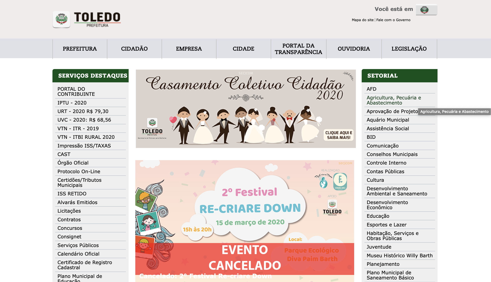

# Project: Este é um projeto Academico - UTFPR - Toledo



>Site atual da Prefeitura de Toledo - PR 2020 

Projeto da Turma de Sítios 2.
Objetivo da disciplina era colocar em pratica framework bootstrap v.4, visto em sala de aula.
Fazer uso de todos o poder desse framework

## Instalação

OS X ,Linux & Windows:

```sh
  git clone https://github.com/digomes87/Refactor-Prefeitura-Toledo.git
```


## About The Project

Nesse projeto, fizemos uso de HTML5 e CSS3, e algumas pequenas implementações de JS


* #### [The final result]()	
* #### [Source page](https://github.com/digomes87/Refactor-Prefeitura-Toledo)


<!-- CONTACT -->
## Autores

* Diego Go – [Twitter](https://twitter.com/@DevDiegoGo) 

* Phone: [Brazil] +55 41 995062619

* Contact - [Email: diego.gomes87@gmail.com](diego.gomes87@gmail.com)


Github [https://github.com/digomes87](https://github.com/digomes87/) 

See this project here [https://github.com/digomes87/wttd-eventex](Bike)

Version for preview [https://eventex-diego.herokuapp.com] (Eventex In heroku)
